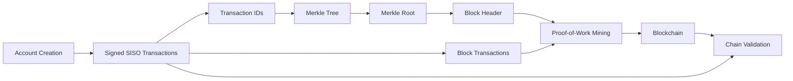

# Final Project Report

## Project Information

- Course: COMP4137 / COMP7200
- Project Title: Implementation of a Mini Blockchain
- Group Number: `<fill in group number>`
- Members:
  - `<Member 1 name, student ID>`
  - `<Member 2 name, student ID>`
  - `<Member 3 name, student ID>`
  - `<Member 4 name, student ID>`

## 1. Introduction

This project implements a compact blockchain system called MiniChain for the COMP4137/COMP7200 programming project. The goal is to demonstrate the core workflow of a blockchain system through a simplified but functional implementation. The final system supports account creation with public-key cryptography, signed single-input-single-output transactions, verifiable Merkle tree construction, linked blocks, Proof-of-Work mining, and integrity verification with tamper detection.

The project was completed in two stages. Phase I focused on transaction generation and the verifiable Merkle tree. Phase II extended the system to block construction, blockchain growth, mining, and chain validation. The final submission also includes reproducibility artifacts such as runnable demos, automated tests, and a README that explains how to install and execute the project.

Each group member should contribute to both implementation and documentation. Replace the following placeholders with the actual team contributions before submission:

- Member A: `<fill in contribution>`
- Member B: `<fill in contribution>`
- Member C: `<fill in contribution>`
- Member D: `<fill in contribution>`

## 2. System Architecture

The project is organized into five functional layers: cryptography, transactions, Merkle tree construction, blockchain and mining, and verification.



The main modules are:

- `src/crypto/`: ECDSA key generation, address derivation, signatures, and hashing utilities.
- `src/models/transaction.py`: transaction structure, transaction ID computation, signing, verification, and serialization for block storage.
- `src/merkle/tree.py`: Merkle root generation, proof construction, and proof verification.
- `src/models/block.py` and `src/models/blockchain.py`: block definition, genesis block creation, linking blocks together, and adding new mined blocks.
- `src/mining/pow.py`: the Proof-of-Work difficulty check.
- `src/verification/validator.py` and `src/verification/tamper_demo.py`: complete chain validation and tampering simulation.

This architecture keeps each major blockchain concept in a dedicated module, making the system easier to test, explain, and extend.

## 3. Design and Implementation

### 3.1 Account and Transaction Generation

The system creates user accounts with elliptic curve cryptography. A private key and public key are generated for each account using the `cryptography` library. The user address is derived from the public key by hashing it with SHA-256 and truncating the result to obtain a compact deterministic identifier for demo purposes.

Each transaction follows a simplified SISO format and contains:

- sender address
- recipient address
- amount
- timestamp
- transaction ID
- sender public key
- digital signature

The transaction ID is computed by hashing the unsigned transaction payload. This is important because the signature itself depends on the transaction hash; therefore, the ID must be derived from the transaction contents before signing. After the ID is computed, the sender signs the transaction ID with the private key. Verification is then performed using the sender public key. To prevent invalid transaction construction, the implementation also checks that the sender address matches the public key used for signing.

When a transaction is stored inside a block, the serialized block record includes the sender public key and signature. This allows the validator to reconstruct the transaction later and re-verify the signature during chain validation.

### 3.2 Verifiable Merkle Tree

The Merkle tree is built from a list of transaction IDs. Each transaction ID is hashed again to create the leaf hashes. Parent nodes are computed by concatenating two child hashes and hashing the result. When a level has an odd number of hashes, the last hash is duplicated so that the next level can still be formed correctly.

The implementation also supports Merkle inclusion proofs. For each transaction, the system records the sibling hashes and whether each sibling is on the left or the right. During verification, the proof is replayed level by level until the computed root is compared with the expected Merkle root. This satisfies the requirement for a verifiable Merkle tree rather than only computing a root hash.

### 3.3 Block and Blockchain Construction

Each block contains:

- block index
- previous block hash
- Merkle root
- timestamp
- nonce
- difficulty
- confirmed transaction records
- block hash

The blockchain starts with a genesis block. This block is a special case because it has no previous block; the implementation therefore uses a fixed previous hash of 64 zeros and a constant Merkle root derived from the string `"genesis"`.

To append a new block, the blockchain first validates the transactions, serializes them into block records, computes the Merkle root from their transaction IDs, and then constructs the block header. The block is only appended after the mining process finds a valid nonce.

### 3.4 Proof-of-Work Mining

The mining mechanism uses a standard leading-zero target. A block is considered valid only when the SHA-256 hash of its header begins with a chosen number of zeros. The miner starts with nonce `0` and repeatedly recalculates the block hash while incrementing the nonce by 1.

The project uses a configurable difficulty parameter. In the final demo, a moderate difficulty is chosen so that mining is still visible and meaningful, but the runtime remains short enough for grading and video recording. This keeps the project practical while still demonstrating the purpose of Proof-of-Work.

### 3.5 Integrity Verification and Tamper Detection

The function `is_chain_valid()` checks the entire blockchain from the genesis block to the latest block. It verifies the following properties:

- each block hash equals the recomputed hash of its own header
- each block hash satisfies the Proof-of-Work difficulty
- each non-genesis block correctly stores the previous block hash
- each transaction record can be reconstructed and its signature re-verified
- each block Merkle root matches the Merkle root recomputed from the stored transaction IDs

The tampering test modifies a transaction in an earlier block. After this change, the chain becomes invalid because the stored transaction data no longer matches its original signature and the Merkle root also becomes inconsistent with the modified transaction set. This behavior demonstrates the core security idea of blockchains: once data in a confirmed block is changed, the inconsistency becomes detectable.

## 4. Testing and Results

The project includes an automated test suite and runnable demos.

### 4.1 Automated Testing

The test suite covers the main functional requirements:

| Test Area | What Was Verified | Result |
|---|---|---|
| Transaction signing | Valid signed transaction verifies correctly | Passed |
| Transaction tampering | Changing the amount invalidates the signature | Passed |
| Transaction serialization | Stored block records preserve public key, signature, and transaction ID | Passed |
| Sender/key mismatch | Invalid sender identity is rejected during signing | Passed |
| Merkle root | Same transaction list always produces the same root | Passed |
| Merkle proof | Inclusion proofs verify successfully for valid leaves | Passed |
| Merkle proof failure | Modified leaf data does not verify | Passed |
| Block linkage | New blocks store the previous block hash correctly | Passed |
| Proof-of-Work | Mining finds a hash that satisfies the target prefix | Passed |
| Chain validation | Valid chain is accepted | Passed |
| Tamper detection | Modified block data is detected | Passed |
| Signature tampering | Corrupted block transaction signature is detected | Passed |

Observed test result in the final local run:

```text
D:\Anaconda\python.exe -m pytest -q
13 passed in 0.67s
```

### 4.2 Demo Results

The Phase I demo produces:

- three generated accounts
- three signed transactions
- one Merkle root
- a verification result for each Merkle proof

The final demo produces:

- one genesis block
- two mined non-genesis blocks
- a valid chain result before tampering
- an invalid chain result after tampering

Observed output from the final blockchain demo:

```text
=== Mini Blockchain Demo ===
[1] Chain valid before tamper: True
[2] Chain summary:
    Block 0: tx_count=1 nonce=87 hash=0002420da160564e... merkle=aeebad4a796fcc2e...
    Block 1: tx_count=2 nonce=1803 hash=00004846ea226057... merkle=cb2e332c78cd842e...
    Block 2: tx_count=1 nonce=2254 hash=000dfca0450d51da... merkle=7ae4d6865b32c58a...
[3] Tamper demo (before, after): True False
[4] Chain length: 3
[5] Latest block hash: 000dfca0450d51da92f811a14280a5d9790670f68f23c0ba801cad4693eb47d5
```

These outputs provide direct evidence that the project satisfies both Phase I and Phase II requirements.

## 5. Reproducibility Artifacts

The codebase was prepared so that another user can reproduce the main results with minimal setup.

The artifact package contains:

- source code under `src/`
- automated tests under `tests/`
- helper scripts under `scripts/`
- documentation and report assets under `docs/`
- dependency list in `requirements.txt`
- installation and execution instructions in `README.md`

Hardware and software requirements are lightweight. The project was tested on Windows with Python 3.12 through `D:\Anaconda\python.exe`, but any Python 3.10+ environment should work.

Estimated setup and execution times:

- dependency installation: about 1 to 3 minutes on a typical laptop
- automated tests: under 1 minute
- Phase I demo: a few seconds
- full blockchain demo: a few seconds at the provided difficulty

The README explains how to install dependencies, run tests, execute demos, and interpret the expected output. This directly supports the reproducibility criteria described in the project specification.

## 6. Conclusion

This project demonstrates a minimal but complete blockchain workflow. Although the implementation does not include advanced features such as networking, wallets, or distributed consensus, it successfully captures the main security and data-structure concepts behind a blockchain system.

The final MiniChain implementation shows how digital signatures protect transactions, how Merkle trees summarize transaction sets, how Proof-of-Work secures block creation, and how chain validation can detect tampering. The project also includes runnable demos and automated tests, which strengthen reproducibility and make the system easier to evaluate.

Possible future improvements include:

- support for multiple transaction inputs and outputs
- persistent storage instead of in-memory execution
- peer-to-peer block propagation
- dynamic mining difficulty
- richer wallet and account management features

## 7. References

1. Dai, Henry Hong-Ning. *COMP4137/COMP7200 Programming Project: Implementation of a Mini Blockchain*. March 5, 2026.
2. Python Software Foundation. *hashlib - Secure hashes and message digests*. [https://docs.python.org/3/library/hashlib.html](https://docs.python.org/3/library/hashlib.html)
3. PyCA Cryptography Developers. *cryptography documentation*. [https://cryptography.io/](https://cryptography.io/)
4. Python Package Index. *cryptography*. [https://pypi.org/project/cryptography/](https://pypi.org/project/cryptography/)

## 8. Appendix Notes for Final Submission

- Replace all placeholder team information before exporting to PDF.
- Insert screenshots of the final test run and demos into the report.
- Keep the final report within the required maximum of 10 pages excluding appendices.
